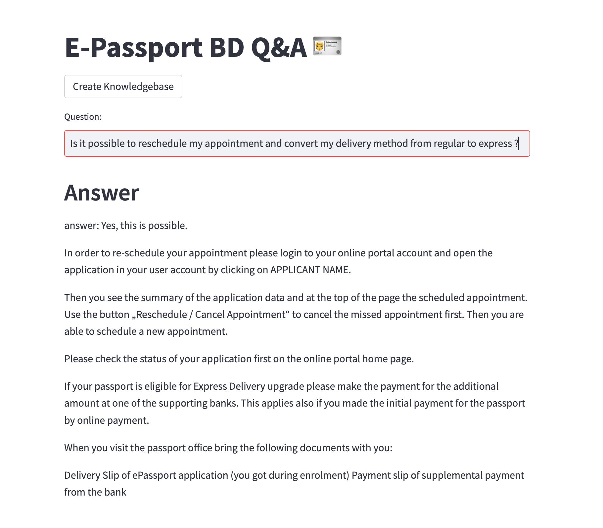

# E-Passport BD Q&A: Question and Answer System Based on Google Palm LLM and Langchain for questions in https://www.epassport.gov.bd/landing/faqs  

Demo: https://epassport-bd-faq-llm.streamlit.app



## Project Highlights

- created and used a CSV file of FAQs enlisted in epassport.gov.bd/landing/faqs. 
- based on the csv file I have created a vector database using Facebook faiss libray.
- Then I have used Langchain Retrieval Chain to create a LLM Chain based on GooglePalm.
- Now we can ask questions about your passport related issues and let LLM give you the answer based on our csv file (sometimes GooglePalm will hallucinate if no answer is found in the CSV file)

## Installation

1. Clone this repository to your local machine using:

```bash
  git clone https://github.com/abijoy/epassport-bd-faq-llm.git
```
2. Navigate to the project directory:

```bash
  cd epassport-bd-faq-llm
```
3. Install the required dependencies using pip (remember to use Python3.11):

```bash
  pip install -r requirements.txt
```
4. Acquire an api key through makersuite.google.com and put it in .env file

```bash
  GOOGLE_API_KEY="your_api_key_here"
```
## Usage

1. Run the Streamlit app by executing:
```bash
streamlit run main.py

```

2. The web app will open in your browser.

- To create a knowledebase of FAQs, click on Create Knolwedge Base button. It will take some time before knowledgebase is created so please wait.

- Once knowledge base is created you will see a directory called faiss_index in your current folder

- Now you are ready to ask questions. Type your question in Question box and hit Enter

## Sample Questions
  - I have lost my delivery slip what should I do now?
  - I have forgot my account password, how do I recover it?
  - Which banks are supported to pay the application fees?
